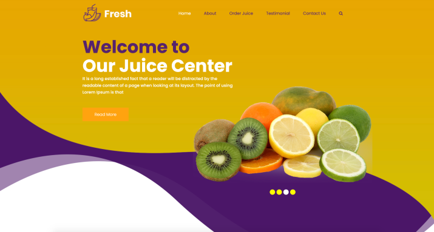

# Fresh Juice Template

Simple E-commerce web application created using HTML, JS & CSS


[](https://github.com/tterb/atomic-design-ui/blob/master/LICENSEs)



## Demo

https://shakkeelaraoof.github.io/fresh_juice_template/

## Run Locally

Clone the project

```bash
  git clone https://github.com/shakkeelaraoof/fresh_juice_template
```

Go to the project directory

```bash
  cd fresh_juice_template
```

To run the application

```bash
  open index.html
```

## Authors

- [@shakkeelaraoof](https://github.com/shakkeelaraoof)


## License

[MIT](https://choosealicense.com/licenses/mit/)
